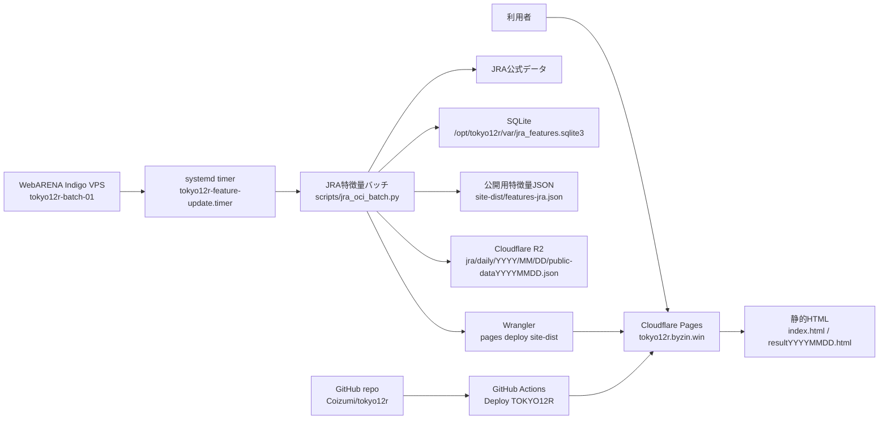

# TOKYO12R JRA Feature Pipeline Specs

## 目的

TOKYO12R by ZIN の公開サイト、運用、インフラ、データ保存、デプロイ、結果表示を定義する。

予想印、指数、買い目生成、的中判定などの予想ロジックは `forcast_for_jra.md` を唯一の参照先とし、この文書にはロジック詳細を記載しない。

## 基本方針

GitHub Actionsには重いデータ収集や過去データ再計算を載せない。

役割分担:

- WebARENA Indigo VPS: データ収集、SQLite蓄積、公開用予想/結果データ生成、週/月/年サマリー生成、公開用特徴量ファイル生成
- WebARENA Indigo VPS: Cloudflare Pagesへの本番デプロイ
- GitHub Actions: 手動再生成、緊急時、検証用のバックアップデプロイ経路
- Cloudflare Pages: 静的サイト配信
- Cloudflare R2: 公開用JRA JSONの日次最終版アーカイブ

WebARENA Indigo は 2GB プランを標準構成とする。

```text
service: WebARENA Indigo Linux
plan: 2GB
cpu: 2vCPU
memory: 2GB
ssd: 40GB
network: 100Mbps upper limit
region: Tokyo
monthly upper limit: 814 JPY
```

VPS側は差分更新とSQLite中心で構成する。全量再取得や重い機械学習は初期対象外とする。

VPSはWebサーバーとして公開しない。公開はCloudflare Pagesに寄せ、VPSはバックエンドバッチと永続DBに限定する。

OCI無料利用枠は、A1 Flexの容量不足とE2.1.Microの実運用余力不足が確認されたため、標準構成から外す。既存のOCI検証リソースは移行前に削除する。

## インフラ構成

TOKYO12Rは、公開配信をCloudflare Pagesへ寄せ、データ収集と公開用データ生成をWebARENA Indigo VPSに集約する。
WebARENA Indigo VPSの電源は自動制御しない。停止または起動が必要な場合は、WebARENA Indigoの管理画面から手動で操作する。



インフラ上の責務:

- Cloudflare Pages: 公開サイト配信のみを担当する
- WebARENA Indigo VPS: JRAデータ収集、SQLite蓄積、公開用予想/結果データ生成、Cloudflare Pages本番デプロイを担当する
- Cloudflare R2: `site-dist/public-dataYYYYMMDD.json` の日次最終版を保存する。履歴DBではなく、公開JSONのアーカイブ用途に限定する
- GitHub Actions: 手動再生成、緊急時、検証用のバックアップデプロイを担当する
- GitHub repository: コード、仕様、systemd unitを管理する

## サイト構成

公開サイトは `https://tokyo12r.byzin.win/` をTOKYO12Rの本体とし、ポータル、JRA予想、地方競馬、JRA結果を明確に分ける。

右上ナビゲーションは、予想ページと結果ページで共通して以下の順にする。

```text
TOP              => https://byzin.win/
TOKYO12R         => https://tokyo12r.byzin.win/   (現在ページの再読み込み)
地方競馬 Today   => https://nar.byzin.win/
結果             => /resultYYYYMMDD.html
```

表示ラベルもこの順序を維持する。`NAR` の省略表記は使わず、利用者が遷移先を理解できる `地方競馬 Today` とする。

### ポータルページ

`https://byzin.win/` は、地方競馬 Today と TOKYO12R への入口として運用する。

ポータルには以下を掲載する。

- 地方競馬と中央競馬の開催日ごとに予想情報を公開していること
- 各サイトで出走表、予想印、買い目、結果確認への導線を整理していること
- 予想は娯楽・参考情報であり、正確な出馬表、払戻、開催情報は公式情報も確認する必要があること
- 広告は運営費の一部に充て、本文やレース情報の閲覧を妨げない配置にすること

AdSense確認用にポータル直下へ `ads.txt` を配置する。

### 計測/広告タグ

TOKYO12Rの公開HTMLは、全ページの `<head>` 内にGoogle AnalyticsとGoogle AdSenseのタグを配置する。

- Google Analytics 測定ID: `G-TG6LR51391`
- Google AdSense publisher ID: `ca-pub-6637962622384846`

対象ページ:

- `index.html`
- `resultYYYYMMDD.html`

### 予想ページ

予想ページは当日または対象開催日のJRA予想を表示する。

構成:

- ヘッダー: ブランド名と右上ナビゲーション
- ヒーロー: TOKYO12Rの視覚要素
- サマリー: 対象日、更新時刻
- 開催場タブ: 開催場ごとにタブを表示し、選択中の開催場だけを表示する
- 各レース共通の買い目: 開催場タブの下に小さめの文字で1回だけ表示する
- レースカード一覧: 選択中の開催場の12レースを、デスクトップでは3列x4行のカードグリッドで表示する
- レースカード: レース番号、レース名、条件、発走時刻、予想印、結果ページへのリンク
- フッター: 年齢注意などの補足

予想印は印、馬番、馬名、人気を同じ行に表示する。馬名は省略表示にせず、カード幅に応じて折り返して全文を表示する。

買い目は全レース共通のため、各レースカード内には繰り返し表示しない。開催場タブ直下に `forcast_for_jra.md` で定義された共通買い目を表示する。

開催場表示は地方競馬 Today と同じタブ型にする。

- タブ要素: `.venue-tabs`, `.venue-tab`
- 各レース共通買い目: `.common-bets`
- パネル要素: `.venue[role="tabpanel"]`
- レース一覧: `.race-list`
- レースカード: `.race-card`
- デスクトップ表示: `.race-list` は3列を基本とし、1開催場12レースを3列x4行に収める
- タブレット表示: `.race-list` は2列に縮退する
- タブ切替: `/assets/site.js` で `data-venue-tab` と `data-venue-panel` を同期する
- 初期表示: 先頭の開催場を選択状態にする
- URL hashが `#venue-1` などの開催場IDを指す場合は、その開催場を初期表示する
- スマートフォン表示では `.topbar` の固定を解除し、`.venue-tabs` を `top: 0` で固定する。スクロール時に開催場タブがヘッダー下へ隠れないようにする

予想ページの各レースカードには、結果ページの該当レースへ移動するリンクを必ず表示する。

```text
/resultYYYYMMDD.html#race-<venue-key>-<race-no>
```

結果が未確定でもリンク先のアンカーは結果ページ側に存在させる。これにより、結果確定前後でリンクの有無やジャンプ先が変わらないようにする。

### 結果ページ

結果ページは `nar.byzin.win` の結果ページと同じく、横並びカードではなく1本の縦方向の柱として表示する。

構成:

- ヘッダー: ブランド名と右上ナビゲーション
- サマリー: 対象日、更新時刻、結果取得状態
- 結果本文: 1カラムの縦並び
- 開催場見出し: 東京、阪神、函館など開催場ごとに区切る
- レース結果カード: 開催場内でレース番号昇順に並べる
- フッター: JRA公式トップページへのリンクと注意文

レース結果カードは、以下の情報を表示する。

- アンカーID: `race-<venue-key>-<race-no>`
- レース番号: `1R` から `12R`
- レース名
- 条件
- 発走時刻
- 1着、2着、3着の馬番と馬名
- 公開済み予想印
- 買い目ごとの的中結果

1着、2着、3着の表示形式:

```text
1着  <馬番> <馬名>
2着  <馬番> <馬名>
3着  <馬番> <馬名>
```

結果未確定のレースは、同じアンカーIDを持つカードを表示し、着順欄には `結果未確定` と表示する。

### 結果ページのアンカー調整

予想ページから結果ページへ遷移したとき、固定ヘッダーによりレース番号が隠れないようにする。

CSS要件:

```css
.result-race-card {
  scroll-margin-top: 96px;
}

@media (max-width: 640px) {
  .result-race-card {
    scroll-margin-top: 132px;
  }
}
```

実装時のクラス名は既存CSSに合わせてよいが、レースカードのアンカー対象要素に十分な `scroll-margin-top` を設定する。

### 買い目結果の表示

結果ページでは、`forcast_for_jra.md` で定義された買い目結果を、的中/不的中/未確定の状態ごとに視覚的に分ける。

的中した買い目:

- 払戻額を表示する
- 明るめのオレンジ系背景で表示する
- 文字色は十分なコントラストを確保する
- 例: `払戻 12,340円`

推奨色:

```text
background: #fff3d6
border:     #f2b866
text:       #6f3d00
amount:     #b45309
```

的中していない買い目:

- 中間調のグレー背景で表示する
- 払戻額は表示しない
- `不的中` または `払戻 0円` のどちらかに統一する

推奨色:

```text
background: #e5e7eb
border:     #cbd5e1
text:       #374151
```

未確定の買い目:

- 低彩度の薄い背景で表示する
- `結果未確定` と表示する
- 的中/不的中とは別状態として扱う

### 公式情報へのリンク

結果ページでは、各レースカード内にJRA公式結果への個別リンクを表示しない。

ページ最下部にのみJRA公式トップページへのリンクを置き、次の文言を必ず表示する。

```text
正確な情報は公式情報を参照ください。
```

フッター例:

```html
<footer>
  <a href="https://www.jra.go.jp/">JRA公式サイト</a>
  <span>正確な情報は公式情報を参照ください。</span>
</footer>
```

## 更新スケジュール

VPSのtimezoneを `Asia/Tokyo` に設定する。

通常更新:

- 金曜 22:10 JST
- 土曜 08:33, 12:33, 15:12, 15:57, 17:33, 22:10 JST
- 日曜 08:33, 12:33, 15:12, 15:57, 17:33 JST
- 月曜 08:33, 12:33, 15:12, 15:57, 17:33 JST
- 火曜 08:33, 12:33, 15:12, 15:57, 17:33 JST

金曜22:10と土曜22:10は翌日分の予想を生成する。翌営業開催を拾うため、対象日から最大4日先まで公式出馬表を確認する。
土曜の日中、日曜、月曜、火曜の更新では対象日を確認する。

月曜・火曜は開催がある場合のみ実処理する。08:33 JSTの開催チェックで開催がないと判定した場合は、その日の `no-race` マーカーを作成し、以後の同日スケジュールは正常終了する。

更新のたびに全開催場の人気順を取得し、公開データを更新する。

### VPS電源管理

WebARENA Indigo VPSの自動停止・自動起動は行わない。通常は稼働状態を維持し、保守などで電源操作が必要な場合に限り、WebARENA Indigoの管理画面から手動で停止または起動する。

## データ保存

VPS上のSQLiteを主ストアとする。

想定パス:

```text
/opt/tokyo12r/var/jra_features.sqlite3
```

主なテーブル:

- `sire_aptitude`: 種牡馬適性参照
- `races`: レース基本情報
- `race_entries`: 出走馬情報
- `past_performances`: 過去走
- `runner_features`: 出走馬単位の公開用特徴量
- `predictions`: 公開した予想印
- `bet_tickets`: 生成した買い目
- `race_results`: 確定着順
- `payouts`: 払戻
- `bet_outcomes`: 買い目結果と損益
- `performance_summaries`: 週間、月間、年間サマリー
- `pipeline_runs`: バッチ実行履歴

公開用には、SQLite全体ではなく軽量JSON/CSVのみを出力する。

## R2公開JSONアーカイブ

Cloudflare R2には、公開用JSONのうち `public-dataYYYYMMDD.json` を日次最終版として保存する。
R2はSQLiteの代替主ストアではなく、公開済みJSONを後から検証・再集計するためのアーカイブとする。

保存キー:

```text
jra/daily/YYYY/MM/DD/public-dataYYYYMMDD.json
jra/latest/public-data.json
```

同一日付の更新は同じ `jra/daily/YYYY/MM/DD/public-dataYYYYMMDD.json` へ上書きする。
このため、土日の日中に複数回更新してもR2に残るのはその日の最終更新版だけとする。

保存対象:

- 公開用の `site-dist/public-dataYYYYMMDD.json`
- 血統詳細などを含む非公開運用データ `/opt/tokyo12r/var/oci-data.json` はR2へ保存しない

WebARENA VPSで `TOKYO12R_R2_ARCHIVE=1` を設定した場合、バッチはCloudflare Pagesへのデプロイ前にR2へアップロードする。
使用バケットは `TOKYO12R_R2_BUCKET`、`R2_BUCKET`、`CLOUDFLARE_R2_BUCKET` の順に参照し、未指定時は既存の `byzin-nar-results` を使う。
GitHub Actionsのバックアップ経路では、repository variable `ENABLE_R2_ARCHIVE=true` の場合だけ同じキーへアップロードする。
R2アップロードは数回リトライし、失敗時はログに残してCloudflare Pagesへの公開デプロイは継続する。

## 的中結果の蓄積

VPSは、公開済み予想と確定結果を同じSQLiteに保存し、買い目単位の結果データを蓄積する。

保存単位:

- レース単位: 開催日、場、R、条件、発走時刻、結果取得状態
- 予想単位: 印、馬名、馬番、人気状態、生成時刻
- 買い目単位: 式別、組み合わせ、点数、想定購入額
- 結果単位: 着順、馬番、馬名、払戻、確定時刻
- 的中単位: 的中有無、払戻額、投資額、回収額、収支

初期の購入額は1点100円換算とする。実購入額ではなく、回収率比較のための仮想集計値として扱う。

サマリー粒度:

```text
weekly  = ISO年 + ISO週
monthly = YYYY-MM
yearly  = YYYY
```

サマリー項目:

- レース数
- 買い目点数
- 的中点数
- 投資額
- 払戻額
- 収支
- 的中率
- 回収率

サマリーは `bet_outcomes` から再計算可能にする。仕様変更後も、履歴データから再集計できるようにする。

## 予想ロジック参照

予想印、指数、血統適性、買い目生成、的中判定の仕様は `forcast_for_jra.md` に記載する。

この文書では、予想ロジックの式、係数、印の選定手順、買い目の生成ルール、的中判定条件を定義しない。実装変更時は `forcast_for_jra.md` を更新する。

## VPSバッチ処理

1回の起動で以下を行う。

1. 実行日または次開催日のJRA開催有無を確認
2. 開催なしなら正常終了
3. 出走表、結果、予想に必要な公式データを取得
4. `forcast_for_jra.md` に従って公開用予想、買い目、結果判定データを生成
5. SQLiteへupsert
6. 公開用特徴量ファイルを出力
7. R2アーカイブが有効なら `site-dist/public-dataYYYYMMDD.json` を日次最終版として保存する
8. Cloudflare Pagesへ `site-dist` を直接デプロイする
9. 必要に応じてGitHub Actions `workflow_dispatch` をバックアップ経路として呼ぶ

systemd timerで `scripts/jra_oci_batch.py` 相当のバッチを実行する。既存コード名にOCIが残る場合も、実行先はWebARENA Indigo VPSとする。後続でファイル名を `jra_vps_batch.py` へ変更できる状態にしておく。

## 失敗時の扱い

- データ取得失敗: リトライ後、前回特徴量を残す
- 一部レース失敗: 成功分のみ保存し、失敗レースをログへ記録
- JRA出走表詳細HTMLから出走馬が0頭として解析された場合: 詳細HTML取得をリトライし、それでも0頭なら公開HTML生成を失敗させる。1レースだけ予想準備中のまま部分公開しない
- SQLite破損対策: 更新前にバックアップを作成
- R2アーカイブ失敗: ログに記録し、公開サイトの更新は継続する
- Actions dispatch失敗: VPS側バッチは失敗扱いにし、ログで検知

## GitHub Actionsとの接続

GitHub Actionsは過去データDBを持たない。VPSが生成した公開用特徴量ファイルを参照する。

初期案:

- VPSが `site-dist/features-jra.json` 相当の軽量JSONを生成
- GitHub Actionsは将来的にそのJSONを取得して `jra_site_updater.py` に渡す

より安定した案:

標準案:

- VPSが `site-dist` を生成する
- VPSがR2へ公開JSONの日次最終版を保存する
- VPSがWranglerでCloudflare Pagesへ直接デプロイする

バックアップ案:

- GitHub Actionsの `workflow_dispatch` を手動または必要時に呼ぶ
- Actions側で公開HTMLを再生成する
- Cloudflare Pagesへデプロイする

## 導入段階

### Phase 1

- WebARENA Indigo 2GB を契約し、Linux VPSを作成
- SSH鍵、ファイアウォール、OS更新、Git/Python/SQLiteを設定
- 既存リポジトリを `/opt/tokyo12r` に配置
- SQLiteスキーマを作成
- systemd timer定義を追加

### Phase 2

- WebARENA VPS上でJRA更新バッチを実行する
- 公開HTML/JSONを `site-dist` に生成する
- 公開JSONの日次最終版をCloudflare R2へ保存する
- Cloudflare Pagesへ直接デプロイする

### Phase 3

- 的中結果と運用サマリーをSQLiteへ保存する
- GitHub Actionsのバックアップデプロイ経路を維持する
- 運用ログと失敗検知を確認する

### Phase 4

- 予想ロジック変更は `forcast_for_jra.md` に集約する
- 運用構成変更は `specs.md` と関連デプロイドキュメントに反映する
